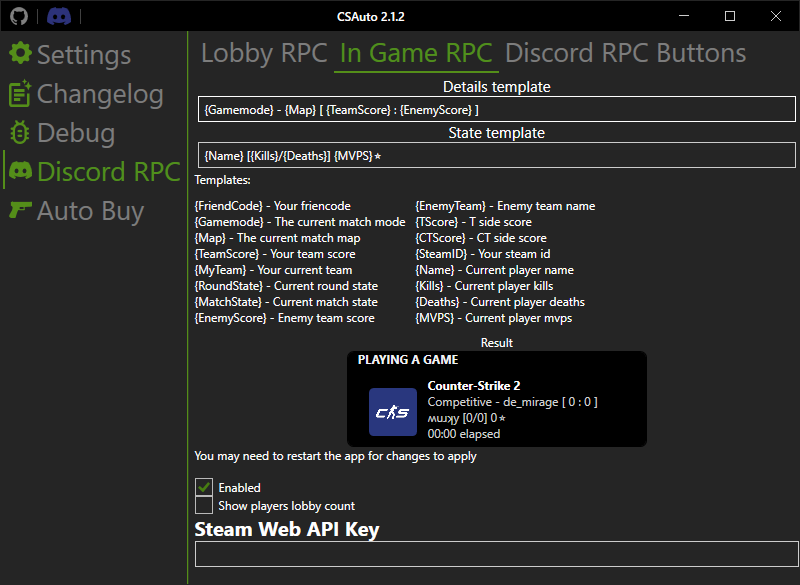

    

   <h1>CSAuto</h1>
   
  

  
  
  

  
  

  
  

<h1 align="center">Описание</h1>

Вы когда нибудь начинали искать игру в CS2, уходили ненадолго, а возвращаясь видите что не приняли игру?
Неприятно, не правда ли? Или забыли купить броню или дефуза за кт?

*Не волнуйтесь!*

**CSAuto** это программа для вас

## Возможности

* Принимает матчи за вас
* Автоматически перезаряжает ваше оружие когда осталось 0 патронов и продолжает стрелять дальше! (продолжение стрельбы может залагать иногда пытаюсь найти фикс)
* Автоматическая покупка выбранных предметов в настраиваемом меню!
* Автоматическая пауза/возобновление в Spotify
* Показывает настраиваемую информацию об игре в Discord Rich Presence (Могут забанить за отображение количества игроков в лобби!)
* Отправлять время, оставшееся до взрыва бомбы, на мобильный телефон! (не точно на данный момент)
* Сфокусириваться на игре, когда появится кнопка "Принять", и возвращаться к предыдущему окну!

## Скрины

## Установка

## Параметры запуска
  * `--show` - Показывать окно настроек при запуске приложения
  * `--maximized` - Сделать так, чтобы окно настроек всегда открывалось развернутым
  * `--language [название языка]` - Изменить язык приложения на указанный (например en,ru), настройки не изменяются
  * `--portable` - Запуск приложения в портативном режиме
  * `--log` - Включение ведения журнала, независимо от того, включено ли оно в настройках, не изменяет настройки
  * `--cs` - Запустить кс вместе с CSAuto

## FAQ

### Как подключиться через мобильное приложение

  1. Убедитесь, что приложение установлено на вашем телефоне
  2. Убедитесь, что вы подключены к той же сети, что и компьютер
  3. В настольном приложении перейдите в категорию `Сервер` и запомните `IP` и `Порт`
  4. Перейдите в настольное приложение в категории `Настройки -> Уведомления по телефону` и убедитесь, что оно включено
  5. Перейдите в мобильное приложение и введите `IP` и `Порт`, которые вы видели в категории `Сервер"
  6. Запустите cs и попробуйте подключиться к серверу в мобильном приложении

### Приложению не удалось настроить параметры запуска, что делать?

  1. Откройте библиотеку Steam
  2. Щелкните правой кнопкой мыши на CS2 и нажмите свойства
  3. На вкладке Общие внизу у вас есть параметры запуска
  4. Добавьте `-gamestateintegration` в параметры запуска
  5. Закройте и запустите игру

### Discord не показывает количество игроков в лобби

   1. Откройте категорию Discord
   2. Получите свой ключ Steam Web API [здесь](https://steamcommunity.com/dev)
   3. Введите свой ключ Steam Web API
   4. После того, как вы ввели его, у вас должно сработать
   5. Если у вас все еще его нет, убедитесь, что вы создали лобби, пригласив кого-нибудь, и то что вы включили показывать количество игроков

### Как получать уведомления в Telegram

   1. Отправьте сообщение [боту](https://t.me/csautonotification_bot)
   2. Получите свой идентификатор чата, отправив сообщение [этому боту](https://t.me/raw_info_bot)
   3. Скопируйте свой "Идентификатор чата"
   4. Перейдите в категорию "Уведомления по телефону" и введите полученный вами идентификатор чата
   
### Какая самая последняя версия для CS:GO
	
  Последняя версия, выпущенная для CS:GO 1.1.2, которую можно скачать [здесь](https://github.com/MurkyYT/CSAuto/releases/tag/1.1.2) Имейте в виду, что некоторые функции могут работать не так, как предполагалось

## Предложения

*Если у вас есть какие-либо предложения, то вы можете создать проблему / обсуждение с включенным в него предложением или использовать [Discord сервер](https://discord.gg/57ZEVZgm5W)*

**Заранее спасибо:)**

## Участники

## Разработка

### Скомпилировать приложения

1. Установите Visual Studio 2022 с C# и .NET MAUI (возможно, вам также понадобится Xamarin).
2. Установите Inno Setup Compiler.
3. Клонируйте репозиторий и откройте решение в Visual Studio 2022
4. Скомпилируете приложения
5. Если вам нужен установщик, вы можете запустить файл compile.bat

## Дисклеймер

CSAuto не является аффилированным лицом, не одобрено и никоим образом официально не связано с [Valve](https://www.valvesoftware.com/en/) и/или [Counter-Strike](https://www.counter-strike.net/)
