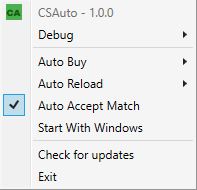

# VanSwitch    
### [Open Latest Release](https://github.com/MurkyYT/VanSwitch/releases/latest).
### [Download Latest Release](https://github.com/MurkyYT/VanSwitch/releases/latest/download/VanSwitch.exe).
Vanguard is the anticheat used in valorant,
Vanguard stays on even when the game isn't started or opened.  

**VanSwitch** tries to address that issue (maybe not for everyone) by giving you the opportunity to enable/disable Vanguard completely or closing vanguard automatically when you exit out of Valorant.  
## How to use
* You can disable/enable vanguard completely thru the 'Disable Vanguard' button or 'Enable Vanguard' in the right click menu (you will need admin rights to do that).  
* VanSwitch also lets you choose if you want to close Vanguard after you have launched the game and played it for a bit and closed it.  
* There is also an option for starting VanSwitch with windows startup.  
**Image demonstration of the menu:**  

## Disclaimer
VanSwitch might not work properly or even break some services.
