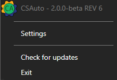
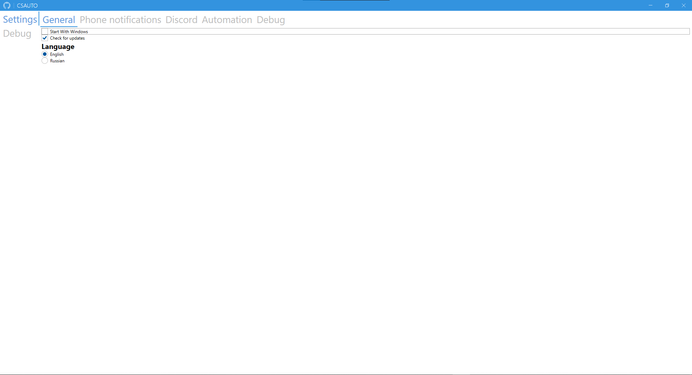

<h1 align="center">CSAuto</h1>
<!-- 

   

-->

  

  
  
  

  
  

<h1 align="center">Description</h1>
Have you ever started searching for a game in CS2 went for a bit, and see that you missed the accept button?  
frustrating isn't it?  
Or have you ever forgot to buy armor or defuse kit as ct?  
  
*Dont Worry!*  
**CSAuto** is the software for you, CSAuto can:
* Auto accept matches for you
* Auto reload for you when you have 0 bullets left and keep spraying after reloading! (continue spraying might lag out trying to find a fix)
* Auto buy armor for you or auto refill it when you have less then 70 left!
* Auto buy defuse kit for you as a CT
* Auto pause/resume spotify song
* Show customizable game info in Discord Rich Presence (show amount of players in lobby can be banable!)
* Send time left till bomb exploded to mobile! (not accurate as of right now)

**Image demonstration of the app:**  

## Installation

    

## FAQ
### **How to connect to the mobile app**
  1. Make sure you have installed the app on your phone
  2. Make sure you are connected to the same network
  3. In the mobile app start the server (and allow ignoring battery optimization)
  4. Go to the desktop app, in the 'Phone notifications' category and make sure it is enabled
  5. Go again to the 'Phone notifications' category and enter the IP address you see in the notification on the phone
### The app couldn't set the launch options, what to do?
  1. Open steam library
  2. Right click on CS2 and press properties
  3. In the general tab you have launch options at the bottom
  4. Add -gamestateintegration to the launch options
  5. Close and start the game
### **Discord doesn't show amount of players in lobby**
  1. Open the discord category
  2. Get your steam web api key from [here](https://steamcommunity.com/dev)
  3. Enter your Steam Web API Key
  5. After you entered it you should have it
  6. If you still dont have it, make sure you created a lobby by inviting someone and enabled it
### **How to get notifications in Telegram**
   1. Send a message to the [bot](https://t.me/csautonotification_bot)
   2. Get your chat id by sending a message to [this bot](https://t.me/raw_info_bot)
   3. Copy your 'Chat ID'
   4. Go to the 'Phone notifications' category and enter the Chat ID you got
## Suggestions
*If you have any suggestions you can create an issue/discussion with the suggestion in it*  
**Thanks in advance :)**
## Contributors
<table>
<tr>
<th align="center">

 
<small>
Name
</small>

</th>
<th align="center">

 
<small>
Helped with
</small>

</th>
</tr>
<tr>
<td align="center">

<a href="https://github.com/NoPlagiarism"> NoPlagiarism </a>
</td>
<td align="center">
Translation, design and app ideas
</td>
</tr>
</table>

## Development

### Building the app

1. Install Visual Studio 2022 with C# and Xamarin.
2. Install Inno Setup Compiler.
3. Clone the repository and open the solution in Visual Studio 2022
4. Build the app
5. If you want the installer you can run the compile.bat
