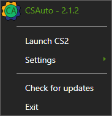

    

   <h1>CSAuto</h1>

  

  
  
  

  
  

  
  

## Description

Have you ever started searching for a game in CS2, left the keyboard for a bit, and noticed that you missed the accept button?
frustrating isn't it?
Or have you ever forgotten to buy armor or defuse kit as ct?
  
*Don't Worry!*  
**CSAuto** is the software for you

## Features

* Auto accept matches for you
* Auto reload for you when you have 0 bullets left and keep spraying after reloading! (continue spraying might lag out trying to find a fix)
* Auto buy selected items in customizable menu!
* Auto pause/resume spotify song
* Show customizable game info in Discord Rich Presence (show amount of players in lobby can be bannable!)
* Send time left till bomb exploded to mobile! (not accurate as of right now)
* Bring game to front when accept button appears and return to previous window!

## Screenshots

## Installation

    

## Launch Options
  * `--show` - Show settings window on application startup
  * `--maximized` - Make settings window always start maximized
  * `--language [language name]` - Change app language to the one specified (e.g en,ru), doesn't change the settings
  * `--portable` - Run the app in portable mode
  * `--log` - Enabling logging, regardless of whether it is enabled in the settings, doesn't change the settings
  * `--cs` - Launch cs with CSAuto

## FAQ

### How to connect thru the mobile app

  1. Make sure you have installed the app on your phone
  2. Make sure you are connected to the same network
  3. In the dekstop app go to the `Server` category and remember the `IP` and `Port`
  4. Go to the desktop app, in the `Settings -> Phone notifications` category and make sure it is enabled
  5. Go to the mobile app and enter the `IP` and `Port` you saw in the `Server` category
  6. Launch cs and try to connect to the server in the mobile app

### The app couldn't set the launch options, what to do?

  1. Open Steam library
  2. Right-click on CS2 and press properties
  3. In the general tab you have launch options at the bottom
  4. Add `-gamestateintegration` to the launch options
  5. Close and start the game

### Discord doesn't show amount of players in lobby

  1. Open the Discord category
  2. Get your Steam web api key from [here](https://steamcommunity.com/dev)
  3. Enter your Steam Web API Key
  4. After you entered it you should have it
  5. If you still don't have it, make sure you created a lobby by inviting someone and enabled it

### How to get notifications in Telegram

   1. Send a message to the [bot](https://t.me/csautonotification_bot)
   2. Get your chat id by sending a message to [this bot](https://t.me/raw_info_bot)
   3. Copy your 'Chat ID'
   4. Go to the 'Phone notifications' category and enter the Chat ID you got
   
### What is the latest version for CS:GO
	
  The latest version released for CS:GO is 1.1.2 and can be downloaded [here](https://github.com/MurkyYT/CSAuto/releases/tag/1.1.2), be warned that some features might not work as intended
  
### Auto pause/resume spotify doesn't work
  
  Make sure the spotify window is open and not hiden in the tray

## Suggestions

*If you have any suggestions you can create an issue/discussion with the suggestion in it or use [Discord server](https://discord.gg/57ZEVZgm5W)*

**Thanks in advance :)**

## Contributors

## Development

### Building the app

1. Install Visual Studio 2022 with C# and .NET MAUI (Maybe you will need Xamarin as well).
2. Install Inno Setup Compiler.
3. Clone the repository and open the solution in Visual Studio 2022
4. Build the app
5. If you want the installer you can run the compile.bat

## Disclaimer

CSAuto is not affiliated, endorsed by, or in any way officially connected with [Valve](https://www.valvesoftware.com/en/) and/or [Counter-Strike](https://www.counter-strike.net/)
